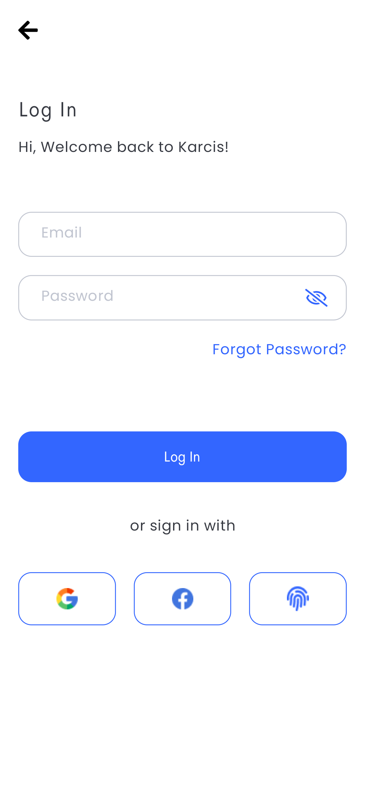
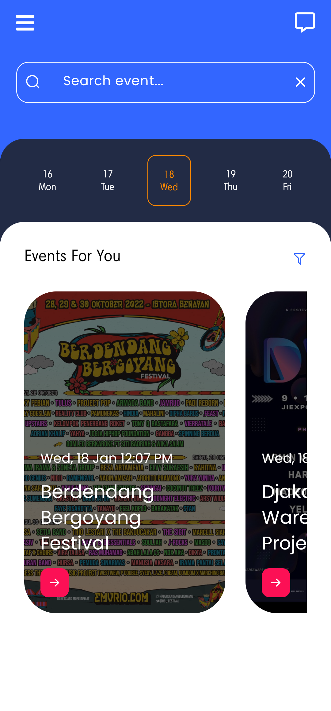
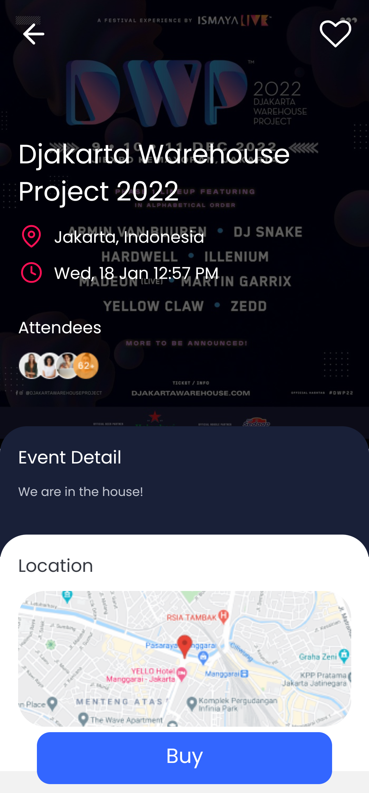
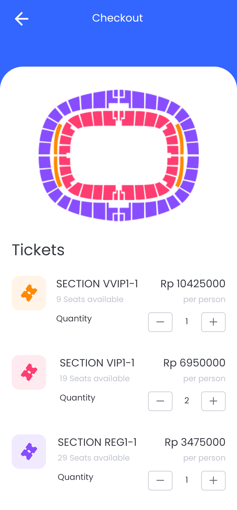
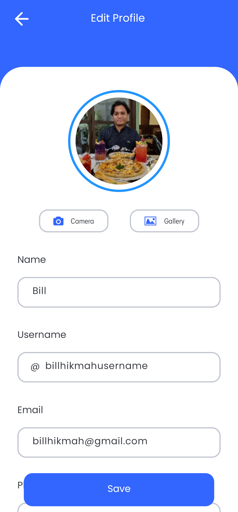
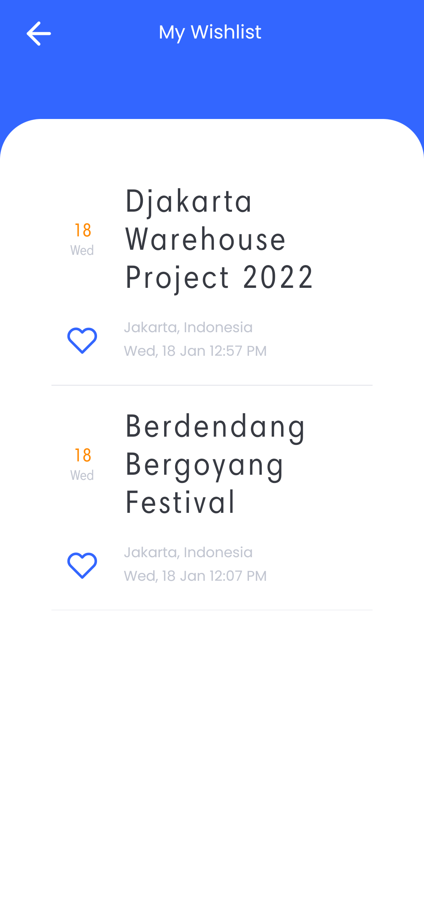

<h1 align='center'>Karcis Mobile Project</h1>
  <p align="center">
    <a href="https://bit.ly/BillHikmah">Download APK</a>
    ·
    <a href="https://github.com/billhikmah/karcis-project-mobile/issues">Report Bug</a>
    ·
    <a href="https://github.com/billhikmah/karcis-project-mobile/pulls">Request Feature</a>
  </p>

<h2>Preview</h2>

<div style="display:flex; justify-content: left; column-gap:20px; margin-bottom:20px">






</div>

<div style="display:flex; justify-content: left; column-gap:20px; margin-bottom:20px">






</div>

## About The Project

Karcis Mobile is an android apps project for purchasing event tickets. This is a mobile version Karcis web. Karcis Mobile is built using React Native.

## Built With

[](https://reactjs.org/)

<h2>How to Install</h2>

1. Download the APK file from the link below
   ```
   https://bit.ly/BillHikmah
   ```
2. Install the APK file on your android

<h2>Related Documentation</h2>

- Server (Backend)<br>
  The backend has been deployed to [Vercel](https://www.vercel.com) and the assets have been uploaded to [Cloudinary](https://www.cloudinary.app/).
- Postman Documentation
  Server documentation can be accessed via [Postman](https://documenter.getpostman.com/view/20723287/VV51tET9).

## License

© [Bill Hikmah 2022](https://github.com/billhikmah/)
